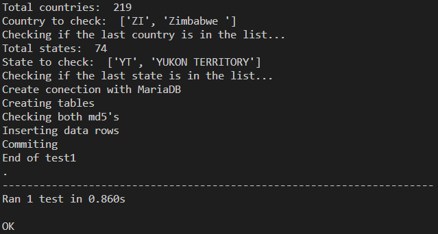

# Proyecto opcional: WindyUI

> Integrantes:
>* Max Richard Lee Chung - 2019185076 
>* Miguel Ku Liang - 2019061913
>* Adriel Araya Vargas -2019312845
>* André Araya Vargas - 2020142856

## Guía de instalación

El programa necesita de la aplicación "Docker" y habilitar el servicio de "Kubernetes" para tener un clúster inicial y básico, llamado "docker-desktop". La aplicación para supervisar el comportamiento del clúster de Docker se denomina "Lens". Además, se utilizarán dos herramientas con sus respectivas carpetas dentro del proyecto para los servicios automatizados tales como Helm_charts (servicios predeterminados) y Docker_images (servicios programados). Finalmente, se está utilizando la herramienta RabbitMQ que maneja el servicio de envío de mensajes entre pods programados dentro del clúster.

### Instalación de helm charts

Primeramente se debe de gestionar las dependencias de los helm charts de databases y elastic que serán necesarias durante toda la ejecución del proyecto. Dentro del archivo Chart.yaml en /databases dentro de /Helm_chart, se encuentran declarados la versión, enlace del repositorio y nombre para poder extraer y descargar como un archivo comprimido los recursos de cada uno en la carpeta Charts dentro del mismo directorio. Los repositorios se deben buscar en Google buscando, como por ejemplo, el repositorio de Bitnami o Elasticsearch. Al conocer el enlace del repositorio, se añade a la librería de helm charts y buscar el nombre del recurso al que se quiera utilizar y actualizar como se muestra en el siguiente bloque de código.

```
helm add repo <enlace proporcionado>    # Agregar a la librería de helm charts
helm update repo <enlace proporcionado> # Actualizar el repositorio
helm search repo <recurso a buscar>     # Buscar la información del recurso
```

Para el funcionamiento del proyecto se van a implementar dos helm charts iniciales que se dedican a correr los servicios de la base de datos, (databases y elastic) y uno para las aplicaciones implementadas en Docker (applications). Dentro del helm chart databases, se utilizó la base de datos de MariaDB y ElasticSearch, y el sistema de mensajería RabbitMQ:

```
#Helm_chart/databases/chart.yalm
dependencies:
- name: rabbitmq
  version: "11.9.0"
  repository: "https://charts.bitnami.com/bitnami"
  condition: enableRabbitMQ
- name: mariadb
  version: "11.4.6"
  repository: "https://charts.bitnami.com/bitnami"
  condition: enableMariaDB
- name: eck-operator
  version: "2.6.1"
  repository: "https://helm.elastic.co"
  condition: enableOperator
```

Es importante recordar que las 3 dependencias necesitan de un usuario y una contraseña fija para instalar y desinstalar. Estas las declararemos en values.yaml dentro de /databases, así podrán ser referenciadas y obtenidas por otros pods. 

```
#Helm_chart/databases/values.yalm
rabbitmq:
    auth:
      # Se agrega un password fija para installar/desinstalar
      password: "rabbitmqpass"
      
  # --------------------------------------------------------------------
  mariadb:
    auth:
      # Se agrega un password fija para installar/desinstalar
      rootPassword: "mariadbpass"
      username: "user"
      password: "user"
      database: "weather"

  elasticsearch:
    auth:
      username: "user"
      password: "user"
```

Una vez que ya tenemos nuestras dependencias podemos empezar a instalar los Helm_charts. Esta será la manera de poner nuestros pods a trabajar para realizar sus respectivas tareas.

Empezaremos instalando elastic utilizando el siguiente comando:

```
Proyecto_opcional\Helm_chart\> helm install elastic elastic
```

También, es necesario correr los siguientes comandos en la terminal para tener localmente las imágenes a utilizar del clúster y la instancia de Kibana.

```
docker pull docker.elastic.co/elasticsearch/elasticsearch:8.6.1
docker pull docker.elastic.co/kibana/kibana:8.6.1
```

Haremos exactamente la misma instalación con databases de segundo:

```
Proyecto_opcional\Helm_chart\> helm install databases databases
```

Una vez hayamos hecho estas instalaciones podremos revisar tanto Lens como Docker para revisar que los pods estén ejecutándose de manera correcta. Lens proporciona una mayor cantidad de herramientas como logs de los pods para encontrar errores y monitorear su funcionamiento. Si todo está en verde y “Running” dentro de la sección “Pods” en Lens, podremos continuar.

### Instalación de docker images.

Para esta sección, es necesario crear una cuenta en Docker Hub para poder guardar las imágenes de las aplicaciones desarrolladas para el proyecto, el cual se usarán para todas las aplicaciones del proyecto, utilizando lenguaje Python para otorgarles la lógica de recibir mensajes de la cola de RabbitMQ y procesarlas.

Luego de tener la cuenta habilitada, dentro de la carpeta general, se crearon -siete- carpetas para las aplicaciones respectivas, en donde cada uno tiene otra carpeta con los datos únicos de configuración de la aplicación de Python y un archivo de configuración "Dockerfile" para poder publicarlo al Docker Hub.

Este Dockerfile contiene la versión de Python a utilizar dentro de las aplicaciones (buster). Además, se siguieron las recomendaciones dadas por el profesor con la configuración necesaria para poder ejecutar la aplicación.

```
FROM python:3.6-buster

RUN apt-get update && apt-get -yy install libmariadb-dev

WORKDIR /app

COPY app/. .

RUN pip install --upgrade pip
RUN pip3 install --no-cache-dir -r requirements.txt

CMD [ "python", "-u", "./app.py"]
```

Dentro de cada aplicación y carpeta de app existe un archivo de texto (requirements.txt) con las librerías necesarias para instalarlas de forma automática luego de publicar la aplicación a Docker Hub. Dicha librerías utilizadas son pika, elasticsearch, mariadb y requests. También es utilizada bs4 para la recuperación de archivos del url.

Luego de crear el archivo de texto, es necesario definir el código fuente de Python para poder conectarlo con la cola de RabbitMQ por medio de variables de entorno, al igual que con su conexión con Elasticsearch y MariaDB. También, define el comportamiento lógico para procesar la información. A continuación se muestra un ejemplo de las variables de entorno del trabajador "processor".

```
hostname = os.getenv('HOSTNAME')
RABBIT_MQ=os.getenv('RABBITMQ')
RABBIT_MQ_PASSWORD=os.getenv('RABBITPASS')
OUTPUT_QUEUE=os.getenv('OUTPUT_QUEUE')
INPUT_QUEUE=os.getenv('INPUT_QUEUE')

ESENDPOINT = os.getenv('ESENDPOINT')
ESPASSWORD = os.getenv('ESPASSWORD')

MARIAHOST = os.getenv('MARIAHOST')
MARIAPORT = os.getenv('MARIAPORT')
MARIAUSER = os.getenv('MARIAUSER')
MARIAPASS = os.getenv('MARIAPASS')
MARIADB = os.getenv('MARIADB')
```

En carpeta de application, es necesario crear modelos o “templates” predefinidos de las aplicaciones con sus respectivas variables de entorno y sus contraseñas (adquiridas por referencias a los secrets). Las variables de entorno es información guardada en variables que son visibles en todo momento y almacenadas en el sistema. Ejemplo:

```
#processor.yalm
apiVersion: apps/v1
kind: Deployment
metadata:
  name: processor
  labels:
    app: processor
spec:
  replicas: 10
  selector:
    matchLabels:
      app: processor
  template:
    metadata:
      labels:
        app: processor
    spec:
      containers:
      - name: processor
        image: basesdedatos2/processor
        env:
          - name: RABBITMQ
            value: "databases-rabbitmq"
          - name: INPUT_QUEUE
            value: {{ .Values.config.processor.input_queue }}
          - name: OUTPUT_QUEUE
            value: {{ .Values.config.processor.output_queue }}
          - name: RABBITPASS
            valueFrom:
              secretKeyRef:
                name: databases-rabbitmq
                key: rabbitmq-password
                optional: false
          - name: MARIAHOST
            value: "databases-mariadb"
          - name: MARIAPORT
            value: "3306"
          - name: MARIAUSER
            value: "user"
          - name: MARIADB
            value: "weather"
          - name: MARIAPASS
            valueFrom:
              secretKeyRef:
                name: databases-mariadb
                key: mariadb-password
                optional: false
          - name: ESENDPOINT
            value: elastic-es-default
          - name: ESPASSWORD
            valueFrom:
              secretKeyRef:
                name: elastic-es-elastic-user
                key: elastic
                optional: false
          - name: ESINDEXDAILY
            value: daily
```

Recordar que aquí es donde se define la naturaleza del objeto. Es decir, el processor es un deployment, mientras orchestrator es un CronJob. Estos son templates recuperados de documentación de Kubernets.

Por último, luego de tener los archivos listos para poder publicarlos a la nube, se siguen los siguientes comandos para poder realizarlo desde la terminal, en la carpeta de ubicación del dockerfile donde el user es el nombre de usuario de Docker. Ejemplo con imagen stations:

```
docker login
docker build -t <user>/stations .
docker images
docker push <user>/stations
```

Luego de hacer el push de las imágenes podremos correr el helm install con las aplicaciones.

```
Proyecto_opcional\Helm_chart>helm install applications applications
```
#### MariaDB

```
mariaDatabase = mariadb.connect(
    host=MARIAHOST,
    port=int(MARIAPORT),
    user=MARIAUSER,
    password=MARIAPASS,
    database=MARIADB
)
connection = mariaDatabase.cursor()
```

```
connection.execute(‘SQL QUERY’)
```

```
mariaDatabase.commit()
mariaDatabase.close()
```


#### Elasticsearch

```
clientES = Elasticsearch("https://" + ESENDPOINT + ":9200", basic_auth = ("elastic", ESPASSWORD), verify_certs = False)
```

```
msg = "{\"data\": [ {\"msg\":\"" + fileName + "\", \"hostname\": \"" + hostname + "\"}]}"
clientES.index(index='files', id=fileName, document=doc)
channel_output.basic_publish(exchange='', routing_key=OUTPUT_QUEUE, body=msg)
```


#### RabbitMQ

```
credentials_input = pika.PlainCredentials('user', RABBIT_MQ_PASSWORD)
parameters_input = pika.ConnectionParameters(host=RABBIT_MQ, credentials=credentials_input)
connection_input = pika.BlockingConnection(parameters_input)
channel_input = connection_input.channel()
channel_input.queue_declare(queue=INPUT_QUEUE)
channel_input.basic_consume(queue=INPUT_QUEUE, on_message_callback=callback, auto_ack=True) 
```

```
credentials_output = pika.PlainCredentials('user', RABBIT_MQ_PASSWORD)
parameters_output = pika.ConnectionParameters(host=RABBIT_MQ, credentials=credentials_output)
connection_output = pika.BlockingConnection(parameters_output)
channel_output = connection_output.channel()
channel_output.queue_declare(queue=OUTPUT_QUEUE)
```

```
channel_input.start_consuming()
```


#### CronJobs
```
apiVersion: batch/v1
kind: CronJob
metadata:
  name: countries
spec:
  schedule: "0 0 * * *" # Run once a day
  jobTemplate:
    spec:
      template:
        spec:
          containers:
          - name: countries
            image: basesdedatos2/countries
            env:
            - name: MARIAHOST
              value: "databases-mariadb"
            - name: MARIAPORT
              value: "3306"
            - name: MARIAUSER
              value: "user"
            - name: MARIADB
              value: "weather"
            - name: MARIAPASS
              valueFrom:
                secretKeyRef:
                  name: databases-mariadb
                  key: mariadb-password
                  optional: false
          restartPolicy: OnFailure
```

#### Deployments
```
apiVersion: apps/v1
kind: Deployment
metadata:
  name: processor
  labels:
    app: processor
spec:
  replicas: {{ .Values.config.processor.replicas }}
  selector:
    matchLabels:
      app: processor
  template:
    metadata:
      labels:
        app: processor
    spec:
      containers:
      - name: processor
        image: basesdedatos2/processor
        env:
          - name: RABBITMQ
            value: "databases-rabbitmq"
          - name: INPUT_QUEUE
            value: {{ .Values.config.processor.input_queue }}
          - name: OUTPUT_QUEUE
            value: {{ .Values.config.processor.output_queue }}
          - name: RABBITPASS
            valueFrom:
              secretKeyRef:
                name: databases-rabbitmq
                key: rabbitmq-password
                optional: false
          - name: MARIAHOST
            value: "databases-mariadb"
          - name: MARIAPORT
            value: "3306"
          - name: MARIAUSER
            value: "user"
          - name: MARIADB
            value: "weather"
          - name: MARIAPASS
            valueFrom:
              secretKeyRef:
                name: databases-mariadb
                key: mariadb-password
                optional: false
          - name: ESENDPOINT
            value: elastic-es-default
          - name: ESPASSWORD
            valueFrom:
              secretKeyRef:
                name: elastic-es-elastic-user
                key: elastic
                optional: false
          - name: ESINDEXDAILY
            value: daily 
```

### Pruebas unitarias
Las pruebas unitarias se realizaron con la librería “unittest” para poder probar las componentes, el cual se le agregaron otras líneas de código al Dockerfile para poder utilizarlas al tener el visto bueno (sin errores).
```
FROM python:3.6-buster

RUN apt-get update && apt-get -yy install libmariadb-dev

WORKDIR /app

COPY app/. .

RUN pip install --upgrade pip
RUN pip3 install --no-cache-dir -r requirements.txt

CMD [ "python", "-u", "./app.py"]
```

#### CronJobs
##### Countries/states
La prueba unitaria del CronJob countries/states se realizará de forma local, dado que no ocupa muchas dependencias del clúster y la mayor parte de su proceso está dentro de la base de datos de MariaDB junto con la extracción de datos de la página NOAA. 

Primeramente, es necesario la inserción correcta de la dirección URL de NOAA para recolectar la información de los “countries” y “states”, ya que si se le otorgan datos incorrectos, el procesamiento de datos tendrá errores lógicos por la separación entre líneas y columnas. 

Luego de procesar la información, se verifica la conexión directa a la base de datos para poder llenar las tablas con sus debidos espacios. Además, se verifica que las tablas se encuentren ya existentes para evitar problemas a la hora de ingresar las debidas filas de las tablas. 

Por último, para verificar que los datos se encuentren bien y correctos, se puede ingresar a la base de datos de forma manual para observar la inserción correcta de las tablas. De esta manera, se pueden realizar cambios en su comportamiento si es necesario. 

###### Resultado
Durante esta prueba unitaria, se verificó si en la lista procesada con los datos del URL de NOAA se encuentra o no el último dato relevante para validar el funcionamiento apropieado del mismo. Luego, siguiendo el flujo lógico, verifica si los datos de prueba de una base de datos local funciona de manera correcta para finalizar con su propósito.  


##### Stations


##### Orquestrator


#### Deployments
##### Proccesor


##### Parser
La prueba unitaria se realizó de forma local, sin embargo, se encontraron problemas a la hora de realizar las pruebas ya que el software no se tiene instalado aparte del clúster. 

Con respecto a la ejecución del componente, el sistema espera a que le llegue un mensaje en la cola designada de RabbitMQ del componente processor. De esta forma, extrae la información del mensaje que es el nombre del archivo para ubicar en el índice de Elasticsearch. 

Luego, se llama a la función "getFile" para poder extraer la información almacenada del contenido URL del respectivo archivo y procesarlo en una lista. Por consiguiente, la información procesada se manda a la función "elasticFiles" para poder agregar la información a un nuevo índice "daily" y el archivo del índice procesado. Por último, se actualiza el estado del archivo en la base de datos MariaDB. 

###### Resultado
Dentro de la prueba, se agregaron try-except para poder ejecutar el archivo sin errores, ya que, como se mencionó anteriormente, el software de Elasticsearch no se encontraba disponible de forma local. Sin embargo, fuera de esto, las demás funciones no tuvieron problemas. 


##### Elements transformation


##### Stations transformation


##### Country transformation 


##### Publisher


## Referencias
* [Repositorio del proyecto](https://github.com/Leemxch/Proyectos-bases-2/tree/main/Proyecto_opcional)
* Bitnami - MariaDB (2022) Github. Recuperdo de [MariaDB](https://github.com/bitnami/charts/tree/master/bitnami/mariadb/)
* Bitnami - RabbitMQ (2022) Github. Recuperado de [RabbitMQ](https://github.com/bitnami/charts/tree/master/bitnami/rabbitmq/)
* Elasticsearch(2023). Recuperado de [Elasticsearch](https://www.elastic.co/guide/en/elastic-stack/current/overview.html)
* MariaDB (2023). Install MariaDB Connector/Python. Recuperado de [MariaDB](https://mariadb.com/docs/skysql/connect/programming-languages/python/install/#TOP)
* Stefano (2020). docker build failed at 'Downloading mariadb'. Recuperado de [StackOverflow](https://stackoverflow.com/questions/64521556/docker-build-failed-at-downloading-mariadb)
* Regolith (2021). How do I disable the SSL requirement in MySQL Workbench? Answer. Recuperado de [StackOverflow](https://stackoverflow.com/questions/69769563/how-do-i-disable-the-ssl-requirement-in-mysql-workbench
)
* Server, David (2019). How can I do 'insert if not exists' in MySQL? Solution. Recuperado de [StackOverflow](https://stackoverflow.com/questions/1361340/how-can-i-do-insert-if-not-exists-in-mysql)
* Geeksforgeeks (2023). MD5 hash in Python. Recuperado de [Geeksforgeeks](https://www.geeksforgeeks.org/md5-hash-python/)
* Castillo, D. (2022). How to Use Elasticsearch in Python. Recuperado de [Dylan Castillo](https://dylancastillo.co/elasticsearch-python/)
* TechOPverflow (2023). How to create ElasticSearch index if it doesn’t already exist in Python. Recuperado de [TechOverflow](https://techoverflow.net/2021/08/04/how-to-create-elasticsearch-index-if-it-doesnt-already-exist-in-python/)
* W3Schools (2023). Python JSON. Recuperado de [W3Schools](https://www.w3schools.com/python/python_json.asp)
